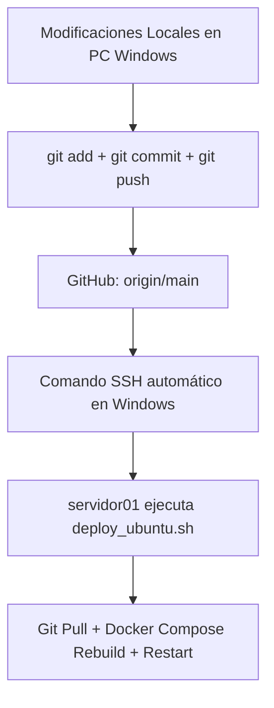

# 🚀 GUÍA DEFINITIVA DE DESPLIEGUE (EUROPA SCRAPER)

Esta guía documenta el **único proceso oficial, estandarizado y profesional** para desplegar cambios locales al servidor de producción Xeon (`servidor01` a través de Tailscale).

---

## 🏗️ Resumen del Flujo de Trabajo Estandarizado

El despliegue está 100% automatizado gracias a la autenticación por llaves SSH y el script de producción en el servidor. El flujo es:



---

## 🔑 1. Autenticación y Conectividad (Ya Configurado)

La comunicación se realiza directamente usando **Tailscale VPN** en la IP privada de producción `100.83.253.87` (DNS: `servidor01`).

### Seguridad de Claves
El agente AI y el terminal de Windows tienen acceso transparente sin contraseña porque:
1. Tu llave pública local de Windows (`~/.ssh/id_ed25519.pub`) está autorizada en el archivo `/home/julio/.ssh/authorized_keys` del servidor.
2. Los permisos locales de tu llave privada `id_ed25519` en Windows están restringidos exclusivamente a tu usuario actual (`julio`), evitando que OpenSSH la ignore por seguridad:
   ```powershell
   # Configurado automáticamente con:
   icacls "$HOME\.ssh\id_ed25519" /inheritance:r
   icacls "$HOME\.ssh\id_ed25519" /grant:r "${env:USERNAME}:F"
   ```

---

## ⚡ 2. El Único Comando de Despliegue (Desde PC Local Windows)

Para desplegar parches y actualizar el servidor desde tu máquina local (o delegárselo al agente AI), abre **PowerShell** en el directorio del proyecto y ejecuta la siguiente secuencia unificada:

```powershell
# Paso A: Enviar cambios al repositorio
git add .
git commit -m "Descripción de los cambios"
git push origin main

# Paso B: Ejecutar el despliegue automático en el servidor
ssh -o StrictHostKeyChecking=no julio@100.83.253.87 "cd /opt/docuscraper && sudo ./deploy_ubuntu.sh"
```

> [!NOTE]
> Al correr el comando `ssh`, el script `deploy_ubuntu.sh` de producción se encargará automáticamente de bajar el código de GitHub, apagar el contenedor anterior de Docker, reconstruir la imagen con las nuevas optimizaciones de `server.py` y levantar el servidor limpio.

---

## 🐳 3. Comandos Útiles del Servidor (Vía SSH)

Si deseas conectarte al servidor manualmente para monitorizar el estado o resolver problemas, puedes usar los siguientes comandos de Docker una vez dentro de `servidor01`:

* **Ver Logs en Tiempo Real**:
  ```bash
  docker compose -f /opt/docuscraper/docker-compose.yml logs -f
  ```
* **Verificar que el Servidor Responda (Ping)**:
  ```bash
  curl http://localhost:8001/ping
  # Debe responder: "EUROPA_SCRAPER_SERVER_PONG"
  ```
* **Detener el Servidor Completo**:
  ```bash
  docker compose -f /opt/docuscraper/docker-compose.yml down
  ```
* **Ver Contenedores Activos**:
  ```bash
  docker ps
  ```

---

> [!IMPORTANT]
> **Mantén la Unicidad**: Se han eliminado todos los scripts y guías obsoletos (`ACTUALIZAR_DOCKER_COMANDOS.md`, `GUIA_CLOUDFLARED_*`, `manual_server_update.sh`) para evitar contradicciones entre agentes. Este documento y `deploy_ubuntu.sh` son la única fuente de verdad para el despliegue.
