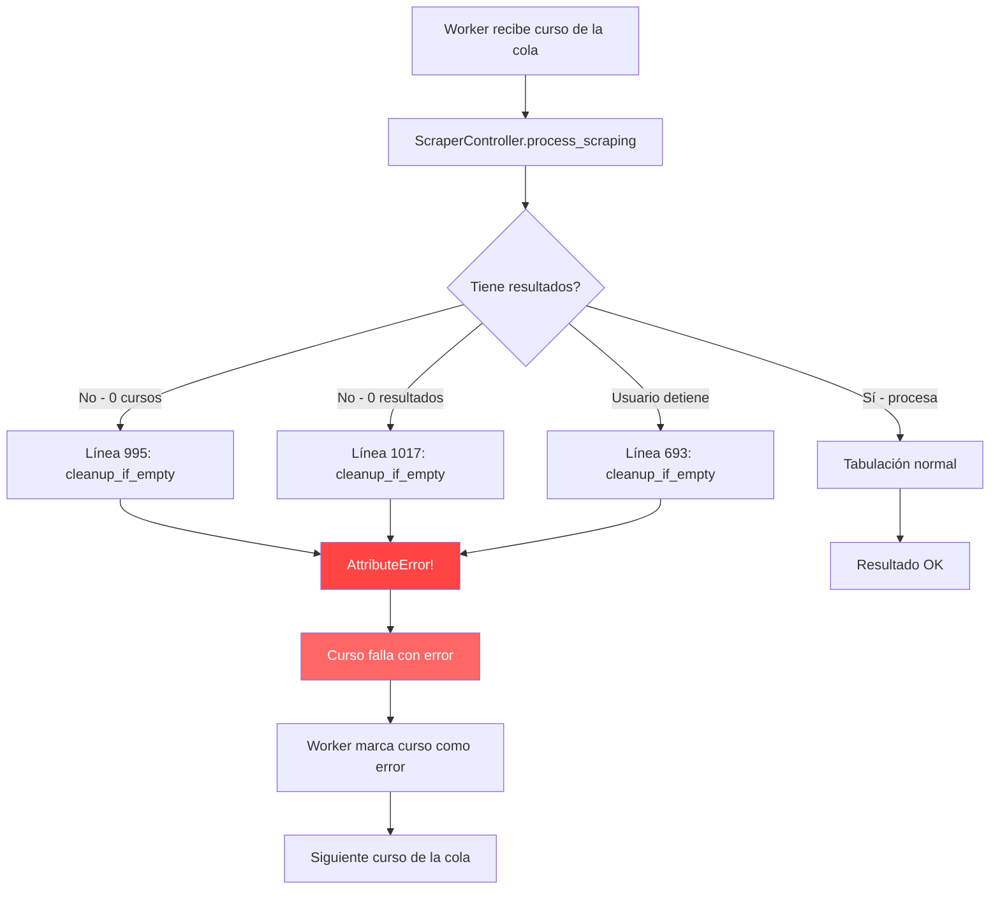
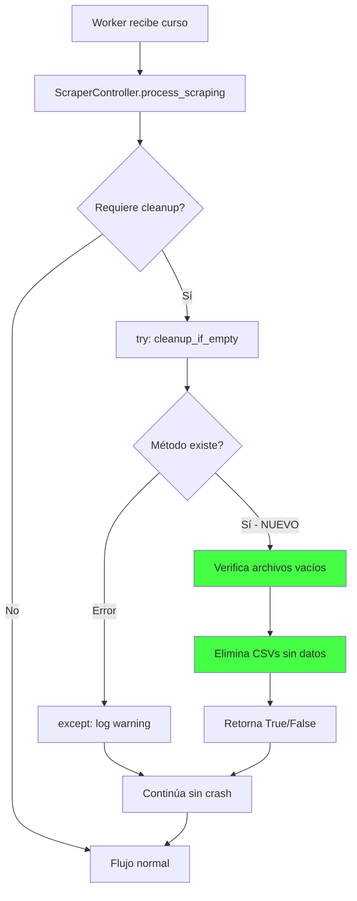

# Plan: Corregir Bug ResultManager.cleanup_if_empty()

## Diagnóstico

### Bug Principal: Método `cleanup_if_empty()` faltante

**Archivo afectado:** `utils/scraper/result_manager.py`
**Clase:** `ResultManager` (línea 11)

La clase `ResultManager` tiene estos métodos:
- `__init____`, `initialize_output_files`, `add_result`, `_get_file_path_for_lang`
- `append_to_csv`, `save_omitted_to_excel`, `get_results`, `get_omitted_results`
- `get_output_file`, `get_omitted_file`

**NO existe** el método `cleanup_if_empty()`.

### Impacto

El método inexistente se llama en **3 lugares** de `controllers/scraper_controller.py`:

| Línea | Contexto | Comentario |
|-------|----------|------------|
| 693 | Scrape detenido por usuario antes de tabulación | Final cleanup check to ensure no empty files are left behind |
| 995 | No se encontraron cursos en el rango | Cleanup empty file if exists - Auto-fix |
| 1017 | No se encontraron resultados de búsqueda | Cleanup empty file if exists - Auto-fix |

Cada llamada genera `AttributeError: ResultManager object has no attribute cleanup_if_empty`, lo que causa que **el curso completo falle**. En la última ejecución, **48+ cursos** fallaron por este error.

### Comportamiento Esperado

Según `test_cordis_flow.py` (líneas 38-45), el método debe:
1. Verificar si el archivo CSV de salida existe y tiene solo cabeceras - sin datos
2. Si está vacío, eliminarlo del disco
3. Retornar `True` si se eliminó algún archivo, `False` si no
4. También limpiar archivos de idiomas y archivos omitidos

### Bug Secundario: `_monitor_job_completion` sin timeout

**Archivo:** `server/server.py` línea 1173

El método usa `work_queue.join()` que bloquea indefinidamente. Si un worker se cuelga, `is_job_running` nunca se pone en `False`, causando que el proceso aparezca como activo para siempre - exactamente lo que pasó con el 98% durante 8+ horas.

---

## Plan de Implementación

### Paso 1: Agregar `cleanup_if_empty()` a `ResultManager`

**Archivo:** `utils/scraper/result_manager.py`
**Ubicación:** Después de `get_omitted_file()` (línea 313)

```python
def cleanup_if_empty(self) -> bool:
    """
    Elimina archivos de salida si solo contienen cabeceras - sin datos.
    
    Returns:
        True si se eliminó algún archivo, False si no
    """
    deleted_any = False
    
    # 1. Limpiar archivo CSV principal
    if self.output_file and os.path.exists(self.output_file):
        try:
            with open(self.output_file, 'r', encoding='utf-8') as f:
                lines = f.readlines()
            if len(lines) <= 1:  # Solo cabecera o vacío
                os.remove(self.output_file)
                logger.info(f"Eliminado archivo vacío: {self.output_file}")
                deleted_any = True
        except Exception as e:
            logger.error(f"Error limpiando output_file: {e}")
    
    # 2. Limpiar archivos por idioma
    if hasattr(self, 'lang_files') and self.lang_files:
        for lang in list(self.lang_files.keys()):
            filepath = self.lang_files[lang]
            if os.path.exists(filepath):
                try:
                    with open(filepath, 'r', encoding='utf-8') as f:
                        lines = f.readlines()
                    if len(lines) <= 1:
                        os.remove(filepath)
                        del self.lang_files[lang]
                        logger.info(f"Eliminado archivo de idioma vacío: {filepath}")
                        deleted_any = True
                except Exception as e:
                    logger.error(f"Error limpiando lang_file {filepath}: {e}")
    
    # 3. Limpiar archivo omitidos
    if self.omitted_file and os.path.exists(self.omitted_file):
        try:
            file_size = os.path.getsize(self.omitted_file)
            if file_size < 200:  # Archivo xlsx vacío es muy pequeño
                os.remove(self.omitted_file)
                logger.info(f"Eliminado archivo omitidos vacío: {self.omitted_file}")
                deleted_any = True
        except Exception as e:
            logger.error(f"Error limpiando omitted_file: {e}")
    
    return deleted_any
```

### Paso 2: Protección defensiva en `scraper_controller.py`

**Archivo:** `controllers/scraper_controller.py`
**Líneas:** 693, 995, 1017

Envolver cada llamada en try/except para que un error en cleanup nunca bloquee el flujo:

```python
# Antes (línea 693):
self.result_manager.cleanup_if_empty()

# Después:
try:
    self.result_manager.cleanup_if_empty()
except Exception as e:
    logger.warning(f"Error en cleanup_if_empty: {e}")
```

Repetir en las 3 ubicaciones.

### Paso 3: Timeout en `_monitor_job_completion`

**Archivo:** `server/server.py` línea 1173

Agregar timeout al `work_queue.join()` para que no bloquee indefinidamente:

```python
def _monitor_job_completion(self):
    """Espera a que la cola se vacíe con timeout anti-bloqueo."""
    timeout_seconds = 3600  # 1 hora máximo por trabajo
    start = time.time()
    
    while True:
        try:
            # Intentar join con timeout de 60 segundos
            self.work_queue.join(timeout=60)
            break  # Cola vacía, salir
        except Exception:
            # timeout - verificar si excedemos el límite
            if time.time() - start > timeout_seconds:
                self.logger.warning(
                    f"Timeout de {timeout_seconds}s alcanzado en _monitor_job_completion. "
                    f"Forzando finalización."
                )
                break
    
    self.logger.info("Toda la carga de trabajo completada.")
    # ... resto igual
```

---

## Archivos a Modificar

| Archivo | Cambio |
|---------|--------|
| `utils/scraper/result_manager.py` | Agregar método `cleanup_if_empty()` |
| `controllers/scraper_controller.py` | Envolver 3 llamadas en try/except |
| `server/server.py` | Agregar timeout a `_monitor_job_completion` |

## Diagrama de Flujo del Bug



## Diagrama de la Solución


